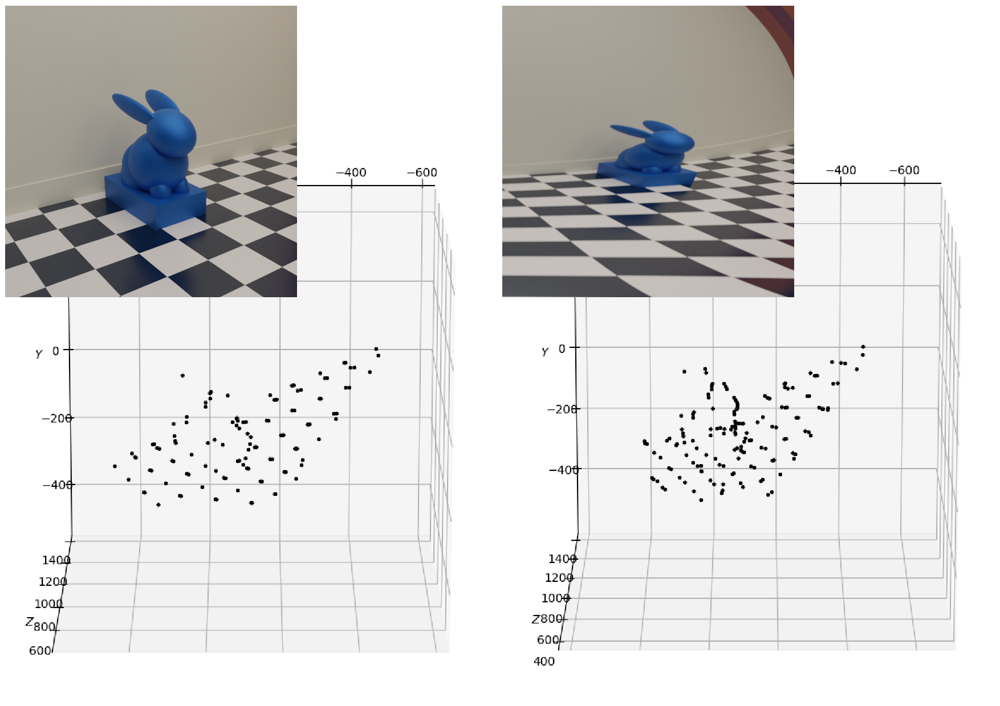
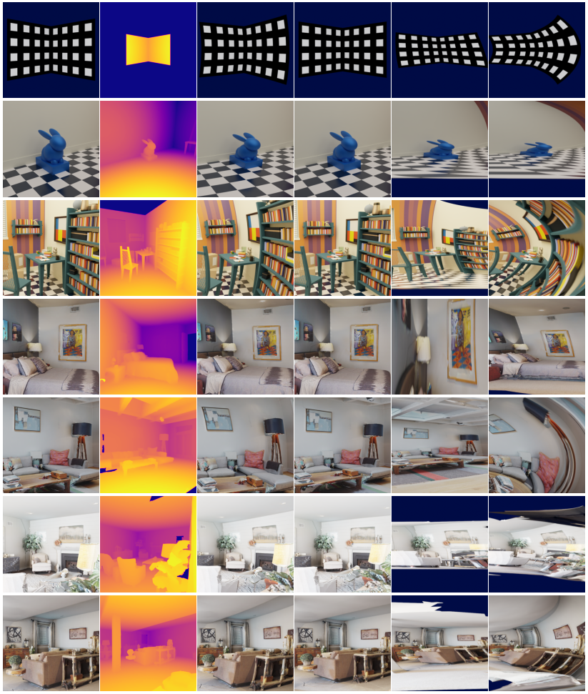

# RSLF: Rolling Shutter Light-Field (WACV 2024)
### [ArXiv](https://arxiv.org/abs/2311.01292)
<div align="center">
 <br>
A method to handle Rolling Shutter deformation in Light-Fields <br><br>
</div>

## Table of Contents
- [Introduction](#introduction)
- [Installation](#installation)
- [Usage](#usage)
- [Dataset](#dataset)
- [Citation](#citation)
- [Acknowledgements](#acknowledgements)


## Introduction
This repository contains the official implementation of the paper: *[Joint 3D Shape and Motion Estimation from Rolling Shutter Light-Field Images](https://arxiv.org/abs/2311.01292)*, to be presented at WACV 2024.

**Abstract**: In this paper, we propose an approach to address the problem of 3D reconstruction of scenes from a single image captured by a light-field camera equipped with a rolling shutter sensor. Our method leverages the 3D information cues present in the light-field and the motion information provided by the rolling shutter effect. We present a generic model for the imaging process of this sensor and a two-stage algorithm that minimizes the re-projection error while considering the position and motion of the camera in a motion-shape bundle adjustment  estimation strategy. Thereby, we provide an instantaneous 3D shape-and-pose-and-velocity sensing paradigm. To the best of our knowledge, this is the first study to leverage this type of sensor for this purpose. We also present a new benchmark dataset composed of different light-fields showing rolling shutter effects, which can be used as a common base to improve the evaluation and tracking the progress in the field. We demonstrate the effectiveness and advantages of our approach through several experiments conducted for different scenes and types of motions.


## Installation
Tested on Ubuntu 22.
Use [conda](https://docs.conda.io/en/latest/miniconda.html) for convenience,

Clone the repository, and build a fresh conda environment for RSLF:
```bash
git clone https://github.com/yourusername/RSLF.git
cd RSLF
conda env create -n rslf_env
conda activate rslf_env
```
Install [pytorch](https://pytorch.org/get-started) and run:
```bash
pip install -r requirements.txt
```
to install dependencies.

## Usage

To run our algorithm on a rolling shutter light-field, few lines of code is enough:
```python
import im2data as im
import Non_linear_method as nlm

name = "rabbit"
mvt_num = 6

im.im2data(name, mvt_num)
res = nlm.nlmethod(name + "_Mvt_" + str(mvt_num), (5000, 0.001))

nlm.plot_result(res)

```
Or you can use this script in the root folder:
```bash
python run_rslf.py
```
You can change the variables *name* and *mvt_num* to change the folder name.

## Dataset
We propose the first dataset that contains rolling shutter light-field images. It contains 7 synthetic scenes with 9x9x512x512x3 LFs for 11 motion scenarios (including one with no motion). Each scene comes with its associated depth map. You can download the dataset [here]().



## Citation
If you find this code and dataset useful for your research, please cite the paper:

```bibtex
@INPROCEEDINGS{McGriff2023cvpr,
  author={Hermes {McGriff} and Renato {Martins} and Nicolas {Andreff} and Cédric {Demonceaux}},
  booktitle={2024 IEEE / Winter Conference on Applications of Computer Vision (WACV)}, 
  title={Joint 3D Shape and Motion Estimation from Rolling Shutter Light-Field Images}, 
  year={2024}}
```

## Acknowledgements
The authors would like to thank the funding from the French “Investissements d’Avenir” program, project ISITE-BFC, contract ANR-15-IDEX-03, by the Conseil Régional BFC from the project ANER-MOVIS and by ”Grand Prix Scientifique 2018, Fond. Ch. Defforey-Institut de France”.

**ICB:** [Laboratoire Interdisciplinaire Carnot de Bourgogne](https://icb.u-bourgogne.fr/)
**Femto-st:** [Franche-Comté Électronique Mécanique Thermique et Optique - Sciences et Technologies](https://www.femto-st.fr/fr)

